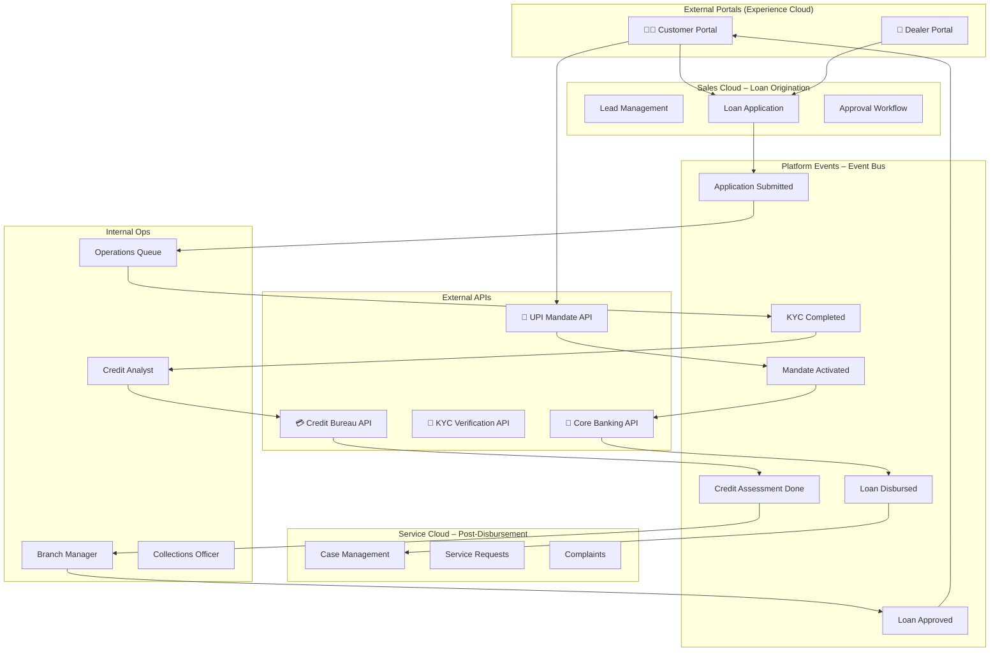

<div align="center">

# 🏦 LendSphere 360

### *Digital Lending, Servicing & Collections Platform*

**A Salesforce-powered multi-channel lending ecosystem enabling customers, dealers, sales teams, operations, credit analysts, service agents, and collections teams to collaborate across the complete loan lifecycle.**

---


</div>

---

## 📌 Table of Contents

1. [Project Vision](#-project-vision)
2. [Architecture Overview](#-architecture-overview)
3. [Technology Stack](#-technology-stack)
4. [User Personas](#-user-personas)
5. [Module Breakdown](#-module-breakdown)
6. [Data Model](#-data-model)
7. [Integrations](#-integrations)
8. [Platform Events](#-platform-events)
9. [Apex Framework](#-apex-framework)
10. [LWC Components](#-lwc-components)
11. [Repository Structure](#-repository-structure)
12. [Setup & Deployment](#-setup--deployment)
13. [Documentation](#-documentation)
14. [Screenshots](#-screenshots)

---

## 🎯 Platform Overview

LendSphere 360 is a **production-grade, Salesforce-native digital lending platform** purpose-built for Banks, NBFCs, and financial institutions operating retail and commercial lending businesses.

The platform addresses a critical operational challenge: most lending institutions run on **fragmented, disconnected systems** — leading to poor customer experience, high processing turnaround times, manual errors, and escalating operational costs. LendSphere 360 brings the **entire loan lifecycle** onto a single, unified Salesforce platform — from lead capture and credit underwriting through disbursement, servicing, and collections.

### Platform Capabilities

| Capability | Description |
|---|---|
| Multi-Cloud Architecture | Sales Cloud, Service Cloud, and Experience Cloud working as a unified ecosystem |
| Event-Driven Design | Six Platform Events enabling real-time, decoupled workflow orchestration |
| End-to-End Loan Lifecycle | Origination, KYC, credit assessment, approval, mandate, disbursement, servicing, collections |
| External API Integrations | Credit Bureau, KYC Verification, UPI Mandate, and Core Banking — all with logging & encryption |
| Self-Service Portals | Dedicated Customer Portal and Dealer Portal built on Experience Cloud |
| Configurable Apex Framework | Trigger framework, service layer, and utility layer designed for enterprise-grade scalability |
| Automated Collections | Batch Apex-driven overdue detection, DPD bucketing, and collections follow-up |
| DevOps Ready | Full SFDX project structure, source-tracked, scratch org and sandbox compatible |

---

## 🏗️ Architecture Overview



---

## 🛠️ Technology Stack

### Salesforce Clouds

| Cloud | Purpose |
|---|---|
| **Sales Cloud** | Lead management, Loan origination, Approval workflows |
| **Service Cloud** | Post-disbursement case management, complaints, service requests |
| **Experience Cloud** | Customer self-service portal, Dealer portal |

### Development

| Technology | Usage |
|---|---|
| **Apex** | Business logic, integrations, trigger handlers, services |
| **LWC** | Reusable UI components across portals and internal apps |
| **Flows** | Record-triggered automation, approval processes, screen flows |
| **Platform Events** | Asynchronous, decoupled event-driven communication |
| **Batch Apex** | EMI generation, collections processing |
| **Queueable Apex** | Disbursement processing, mandate setup |
| **Scheduled Apex** | Reminder notifications, collections follow-up |
| **SOQL/SOSL** | Data queries with governor limit awareness |

### Integration & Security

| Technology | Usage |
|---|---|
| **REST Callouts** | Credit Bureau, KYC, UPI Mandate, Core Banking APIs |
| **Named Credentials** | Secure endpoint management |
| **Custom Metadata Types** | Configuration-driven design |
| **Encryption/Decryption** | PAN/Aadhaar data protection |
| **Request/Response Logging** | Full audit trail for API calls |

---

## 👥 User Personas

### External Personas

| Persona | Access | Portal |
|---|---|---|
| **Customer** | View loans, upload docs, track applications, setup mandates, raise cases, download statements | Customer Portal |
| **Dealer** | Create applications, upload documents, track progress, view commissions | Dealer Portal |
| **Sales Executive** | Create leads, create customers, submit applications, follow-ups | Internal App |

### Internal Personas

| Persona | Responsibility | Queue/App |
|---|---|---|
| **Operations Officer** | KYC & document verification, initial screening | Operations Queue |
| **Credit Analyst** | Credit score review, eligibility, risk evaluation | Credit App |
| **Branch Manager** | Final sanction approval | Approval App |
| **Customer Service Agent** | Case resolution, customer communication | Service Console |
| **Collections Officer** | EMI follow-ups, delinquency management | Collections App |

---

## 📦 Module Breakdown

### 1. Lead Management
- Lead creation from sales team / dealer / customer self-registration
- Lead-to-Opportunity conversion
- Auto-assignment rules to sales representatives

### 2. Customer Onboarding
- Account and Contact creation
- Initial KYC data capture (PAN, Aadhaar, DOB, address)
- Document checklist generation

### 3. Loan Application
- Product selection (Home Loan, Personal Loan, Vehicle Loan, etc.)
- Loan amount, tenure, and interest rate capture
- Co-applicant management
- Multi-step LWC wizard

### 4. KYC Verification
- PAN validation via external API
- Aadhaar validation via external API
- Face match (API mock)
- KYC status tracking on `KYC_Request__c`

### 5. Document Management
- Drag-and-drop document upload (LWC)
- Document type classification
- Version management
- Operations team verification workflow

### 6. Credit Assessment
- Automated credit bureau API callout on application submission
- Credit score storage on `Credit_Assessment__c`
- Risk grade calculation (A/B/C/D/E)
- Credit analyst review queue

### 7. Approval Workflow
- Three-stage approval: Operations → Credit Analyst → Branch Manager
- Automated rejections with reason capture
- Email notifications at each stage

### 8. UPI / eNACH Mandate Setup
- Post-sanction mandate request to customer portal
- Customer chooses UPI or eNACH
- API integration with mandate provider
- Mandate tracking on `Mandate__c`

### 9. Loan Disbursement
- Queueable Apex calls Core Banking API
- Disbursement record created (`Disbursement__c`)
- EMI schedule auto-generated (`EMI_Schedule__c`)
- Customer notified via email + portal

### 10. Customer Self-Service
- View active loans and EMI schedule
- Download loan statements (PDF)
- Raise support cases
- Track application status in real-time

### 11. Case Management (Service Cloud)
- Inbound case creation from Customer Portal
- Auto-routing to appropriate service queue
- SLA tracking
- Email-to-case integration

### 12. Collections Management
- Automated detection of overdue EMIs (Batch Apex)
- `Collection_Case__c` auto-creation
- Collections officer assignment
- Follow-up activity scheduling (Scheduled Apex)
- Delinquency reporting dashboard

### 13. Reporting & Analytics
- Management: Applications, Approvals, Disbursements, Revenue
- Operations: KYC backlog, Document verification queue
- Credit: Risk distribution, Approval trends
- Collections: Overdue portfolio, Recovery rate

---

## 🗄️ Data Model

### Standard Objects Used

| Object | Purpose |
|---|---|
| `Lead` | Prospective customers |
| `Account` | Customer accounts |
| `Contact` | Customer contacts |
| `Opportunity` | Loan opportunities |
| `Case` | Post-disbursement support |
| `Task` | Follow-up activities |
| `ContentDocument` | Document storage |

### Custom Objects

| Object | Key Fields | Purpose |
|---|---|---|
| `Loan_Application__c` | Loan_Number__c, Loan_Amount__c, Product__c, Status__c, Interest_Rate__c, Tenure__c | Core loan application |
| `Loan_Product__c` | Product_Name__c, Product_Type__c, Min_Amount__c, Max_Amount__c, Base_Rate__c | Product catalog |
| `KYC_Request__c` | PAN__c, Aadhaar__c, Verification_Status__c, Verified_Date__c | KYC tracking |
| `Document__c` | Document_Type__c, Verification_Status__c, Upload_Date__c | Document management |
| `Credit_Assessment__c` | Credit_Score__c, Risk_Grade__c, Bureau_Reference__c | Bureau score storage |
| `Mandate__c` | Mandate_Type__c, Mandate_Status__c, VPA__c, Bank_Account__c | UPI/eNACH details |
| `Disbursement__c` | Disbursed_Amount__c, Disbursement_Date__c, Reference_Number__c | Disbursement records |
| `EMI_Schedule__c` | EMI_Number__c, Due_Date__c, EMI_Amount__c, Status__c | Repayment schedule |
| `Collection_Case__c` | DPD__c, Outstanding_Amount__c, Collection_Status__c | Collections tracking |
| `Application_Log__c` | Log_Level__c, Error_Message__c, Stack_Trace__c, Related_Record_Id__c | Error/audit logging |

---

## 🔌 Integrations

### Integration 1: Credit Bureau API
- **Purpose**: Fetch CIBIL/Experian credit score
- **Trigger**: On Loan Application submission
- **Auth**: OAuth 2.0 via Named Credential
- **Method**: `CreditBureauCallout.cls` → Queueable
- **Logging**: Full request/response logged on `Application_Log__c`

### Integration 2: KYC Verification API
- **Purpose**: PAN validation + Aadhaar verification
- **Trigger**: Operations officer action
- **Auth**: API Key via Named Credential
- **Method**: `KYCCallout.cls`
- **Security**: PAN/Aadhaar encrypted via `EncryptionUtil.cls`

### Integration 3: UPI Mandate API
- **Purpose**: Setup auto-debit for EMI collection
- **Trigger**: Customer mandate setup on portal
- **Auth**: HMAC signature + API Key
- **Method**: `MandateCallout.cls` → Queueable
- **Standard**: Follows NPCI UPI AutoPay and eNACH mandate protocols used across the banking and NBFC industry

### Integration 4: Core Banking API
- **Purpose**: Loan disbursement to customer account
- **Trigger**: Branch Manager sanction approval
- **Auth**: mTLS + API Key via Named Credential
- **Method**: `CoreBankingCallout.cls` → Queueable
- **Logging**: Full audit trail + rollback handling

---

## ⚡ Platform Events

| Event | Published By | Consumed By | Purpose |
|---|---|---|---|
| `Application_Submitted__e` | Loan Application flow | Operations trigger handler | Route to Operations queue |
| `KYC_Completed__e` | KYC service | Credit Assessment trigger | Trigger bureau callout |
| `Credit_Assessment_Completed__e` | Credit service | Credit analyst flow | Notify analyst for review |
| `Loan_Approved__e` | Approval flow | Mandate setup trigger | Trigger mandate request |
| `Mandate_Activated__e` | Mandate service | Disbursement queueable | Trigger disbursement |
| `Loan_Disbursed__e` | Disbursement service | EMI generation batch | Generate repayment schedule |

---

## 🧱 Apex Framework

### Trigger Framework (One Trigger Per Object)

```
TriggerHandler.cls          ← Abstract base class
├── LoanApplicationTrigger.trigger
├── LoanApplicationTriggerHandler.cls
├── KYCRequestTrigger.trigger
├── KYCRequestTriggerHandler.cls
├── CreditAssessmentTrigger.trigger
└── ... (one per object)
```

### Service Layer

```
LoanApplicationService.cls  ← Core application business logic
CreditService.cls           ← Credit assessment orchestration
KYCService.cls              ← KYC workflow management
MandateService.cls          ← UPI/eNACH mandate processing
DisbursementService.cls     ← Disbursement orchestration
CollectionService.cls       ← Collections workflow
```

### Integration Layer

```
CreditBureauCallout.cls     ← Credit score fetch
KYCCallout.cls              ← PAN/Aadhaar verification
MandateCallout.cls          ← UPI mandate setup
CoreBankingCallout.cls      ← Loan disbursement
CalloutLogger.cls           ← Request/Response logging
```

### Utility Layer

```
EncryptionUtil.cls          ← AES-256 encryption/decryption
JsonUtil.cls                ← Safe JSON serialization/parsing
DateUtil.cls                ← EMI date calculations
ApplicationLogger.cls       ← Centralized error logging
```

### Async Processing

```
DisbursementQueueable.cls   ← Core Banking API callout
MandateQueueable.cls        ← Mandate API callout
EMIGenerationBatch.cls      ← Batch EMI schedule creation
CollectionsBatch.cls        ← Overdue EMI detection
ReminderScheduler.cls       ← Scheduled notifications
```

---

## 🎨 LWC Components

| Component | Used In | Description |
|---|---|---|
| `loanApplicationWizard` | Customer & Dealer Portal | Multi-step application form with validation |
| `customerDashboard` | Customer Portal | Active loans, EMI due dates, quick actions |
| `creditScoreViewer` | Internal Credit App | Gauge chart for credit score + risk factors |
| `documentUpload` | All Portals | Drag & drop upload with progress tracking |
| `loanTracker` | Customer Portal | Visual lifecycle timeline tracker |
| `emiCalculator` | Customer Portal | Real-time EMI calculation tool |
| `collectionsDashboard` | Collections App | DPD aging, overdue portfolio, actions |

---

## 📁 Repository Structure

```
LendSphere-360/
│
├── 📄 README.md
├── 📄 sfdx-project.json
├── 📄 .forceignore
│
├── 📂 docs/
│   ├── BusinessRequirements/    → BRD.md
│   ├── SolutionArchitecture/    → SA.md
│   ├── HLD/                     → HLD.md
│   ├── LLD/                     → LLD.md
│   ├── UserStories/             → UserStories.md
│   ├── ERD/                     → ERD.md
│   ├── SequenceDiagrams/        → SequenceDiagrams.md
│   └── APIContracts/            → APIContracts.md
│
├── 📂 force-app/
│   └── main/default/
│       ├── objects/             → Custom object XML metadata
│       ├── classes/             → Apex classes
│       ├── triggers/            → Apex triggers
│       ├── lwc/                 → Lightning Web Components
│       ├── flows/               → Flow definitions
│       ├── platformEventChannels/ → Platform event channels
│       ├── customMetadata/      → Custom metadata records
│       ├── permissionsets/      → Permission set definitions
│       ├── namedCredentials/    → Named credential metadata
│       ├── customLabels/        → Custom labels
│       ├── staticresources/     → Static resources
│       └── layouts/             → Page layouts
│
├── 📂 scripts/
│   └── apex/                   → Anonymous Apex scripts for setup/testing
│
└── 📂 screenshots/             → UI screenshots for portfolio
```

---

## 🚀 Setup & Deployment

### Prerequisites

- [Salesforce CLI](https://developer.salesforce.com/tools/sfdxcli) installed
- [VS Code](https://code.visualstudio.com/) with [Salesforce Extension Pack](https://marketplace.visualstudio.com/items?itemName=salesforce.salesforcedx-vscode)
- Salesforce Developer Edition org or Scratch Org

### Clone & Setup

```bash
# Clone the repository
git clone https://github.com/manasvivg/LendSphere-360.git
cd LendSphere-360

# Authenticate to your org
sf org login web --alias LendSphere-Dev

# Deploy metadata to org
sf project deploy start --source-dir force-app --target-org LendSphere-Dev

# Run all Apex tests
sf apex run test --test-level RunLocalTests --target-org LendSphere-Dev
```

### Scratch Org Setup (Optional)

```bash
# Create scratch org
sf org create scratch --definition-file config/project-scratch-def.json --alias LendSphere-Scratch --duration-days 30

# Push source
sf project deploy start --target-org LendSphere-Scratch

# Open org
sf org open --target-org LendSphere-Scratch
```

---

## 📚 Documentation

| Document | Description |
|---|---|
| [Business Requirements Document](docs/BusinessRequirements/BRD.md) | Full BRD with personas, pain points, functional requirements |
| [Solution Architecture](docs/SolutionArchitecture/SA.md) | Cloud architecture, integration design, security model |
| [High Level Design](docs/HLD/HLD.md) | End-to-end flow diagrams, component interaction |
| [Low Level Design](docs/LLD/LLD.md) | Object model, trigger framework, service layer design |
| [User Stories](docs/UserStories/UserStories.md) | Agile user stories in BDD format |
| [Entity Relationship Diagram](docs/ERD/ERD.md) | Complete data model with relationships |
| [Sequence Diagrams](docs/SequenceDiagrams/SequenceDiagrams.md) | End-to-end process sequence diagrams |
| [API Contracts](docs/APIContracts/APIContracts.md) | Request/response contracts for all 4 integrations |

---

## 🖼️ Screenshots

> UI screenshots for each module are available in the [`screenshots/`](screenshots/) directory.

---

## 🧑‍💻 Author

**Manasvi Gharat**

Salesforce Developer | Techno-Functional Consultant | Banking & NBFC Domain Expert

[](https://linkedin.com/in/manasvigharat)
[](https://github.com/manasvivg)

---

## 📄 License

This project is licensed under the MIT License. See [LICENSE](LICENSE) for details.

---

<div align="center">

*A production-grade Salesforce lending platform for Banks, NBFCs, and financial institutions.*

</div>
