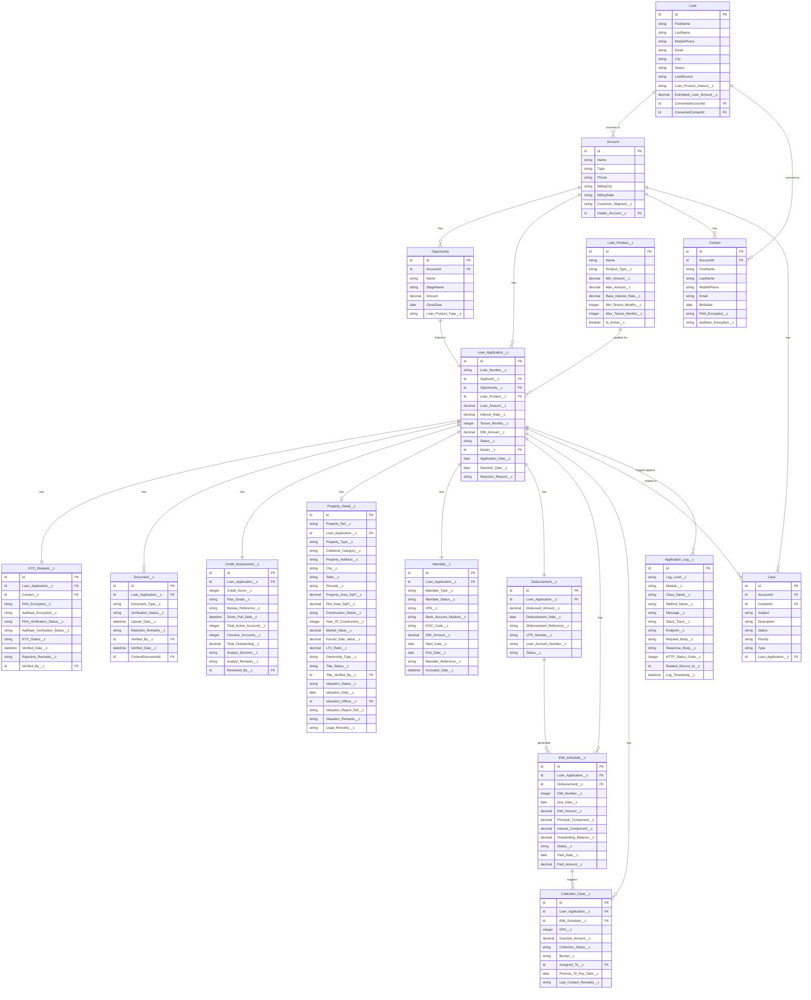

# Entity Relationship Diagram (ERD)

## LendSphere 360 – Data Model

| Field | Details |
|---|---|
| **Document Version** | 1.0 |
| **Status** | Approved |
| **Prepared By** | Manasvi Gharat |
| **Date** | May 2026 |

---

## 1. Complete ERD



---

## 2. Object Summary Table

| Object Type | API Name | Record Count (Expected) | Purpose |
|---|---|---|---|
| Standard | `Lead` | Thousands | Prospective customers |
| Standard | `Account` | Thousands | Customer + Dealer accounts |
| Standard | `Contact` | Thousands | Customer contacts |
| Standard | `Opportunity` | Thousands | Loan pipeline |
| Standard | `Case` | Thousands | Service requests |
| Custom | `Loan_Application__c` | Thousands | Core loan record |
| Custom | `Loan_Product__c` | < 50 | Product catalog |
| Custom | `KYC_Request__c` | Thousands (1:1 with App) | KYC tracking |
| Custom | `Document__c` | Tens of thousands | Document records |
| Custom | `Credit_Assessment__c` | Thousands (1:1 with App) | Credit scores |
| Custom | `Property_Detail__c` | Thousands (conditional) | Collateral evaluation |
| Custom | `Mandate__c` | Thousands (1:1 with App) | Mandate details |
| Custom | `Disbursement__c` | Thousands (1:1 with App) | Disbursement records |
| Custom | `EMI_Schedule__c` | Millions | EMI repayment schedule |
| Custom | `Collection_Case__c` | Tens of thousands | Collections tracking |
| Custom | `Application_Log__c` | Millions | Audit/error log |

---

## 3. Key Relationships

### Primary Relationships

```
Account (1) ──── (M) Loan_Application__c
                         │
                         ├── (1) KYC_Request__c
                         ├── (M) Document__c
                         ├── (1) Credit_Assessment__c
                         ├── (0..1) Property_Detail__c  (conditional: secured products)
                         ├── (1) Mandate__c
                         ├── (1) Disbursement__c
                         │       └── (M) EMI_Schedule__c
                         │               └── (M) Collection_Case__c
                         └── (M) Application_Log__c
```

### Cross-Object Rollup Strategy

| Rollup | Parent Object | Child Object | Aggregation |
|---|---|---|---|
| Total Disbursed | Account | Disbursement__c | SUM(Disbursed_Amount__c) |
| Active Loan Count | Account | Loan_Application__c | COUNT (Status = Disbursed) |
| Total Overdue | Loan_Application__c | EMI_Schedule__c | SUM (Status = Overdue) |
| Total Paid EMIs | Loan_Application__c | EMI_Schedule__c | COUNT (Status = Paid) |

---

## 4. Field-Level Detail: Loan_Application__c

| Field Label | API Name | Data Type | Required | Notes |
|---|---|---|---|---|
| Loan Number | Loan_Number__c | Auto Number | Yes | LSP-{YYYY}-{000000} |
| Applicant | Applicant__c | Lookup (Account) | Yes | Master customer account |
| Opportunity | Opportunity__c | Lookup (Opportunity) | No | Linked opportunity |
| Loan Product | Loan_Product__c | Lookup (Loan_Product__c) | Yes | |
| Loan Amount | Loan_Amount__c | Currency | Yes | Requested amount |
| Sanctioned Amount | Sanctioned_Amount__c | Currency | No | Approved amount |
| Interest Rate | Interest_Rate__c | Percent | Yes | Annual rate |
| Tenure (Months) | Tenure_Months__c | Number | Yes | 12-360 |
| EMI Amount | EMI_Amount__c | Currency | No | Calculated |
| Status | Status__c | Picklist | Yes | See status values |
| Application Date | Application_Date__c | Date | Yes | Default: Today |
| Sanction Date | Sanction_Date__c | Date | No | Set on approval |
| Rejection Reason | Rejection_Reason__c | Textarea | No | Required if rejected |
| Dealer | Dealer__c | Lookup (Account) | No | If dealer-sourced |
| Co-Applicant Name | Co_Applicant_Name__c | Text | No | |
| Co-Applicant PAN | Co_Applicant_PAN__c | Text (Encrypted) | No | |

**Status Picklist Values:**
`Draft` → `Submitted` → `Under Review` → `KYC Verified` → `Credit Assessment` → `Property Evaluation` → `Sanctioned` → `Mandate Pending` → `Mandate Active` → `Disbursed` → `Rejected` → `Closed`

---

## 5. Field-Level Detail: EMI_Schedule__c

| Field Label | API Name | Data Type | Notes |
|---|---|---|---|
| Loan Application | Loan_Application__c | Master-Detail | Parent loan |
| Disbursement | Disbursement__c | Lookup | Parent disbursement |
| EMI Number | EMI_Number__c | Number | Sequential: 1, 2, 3... |
| Due Date | Due_Date__c | Date | Monthly from disbursement |
| EMI Amount | EMI_Amount__c | Currency | Fixed amount |
| Principal Component | Principal_Component__c | Currency | Reducing balance |
| Interest Component | Interest_Component__c | Currency | On outstanding |
| Outstanding Balance | Outstanding_Balance__c | Currency | After EMI payment |
| Status | Status__c | Picklist | Upcoming / Due / Overdue / Paid |
| Paid Date | Paid_Date__c | Date | Actual payment date |
| Paid Amount | Paid_Amount__c | Currency | Actual payment amount |
| Days Past Due | DPD__c | Formula | TODAY() - Due_Date__c if Overdue |

---

## 6. Custom Metadata Types

| CMT Name | API Name | Purpose | Example Records |
|---|---|---|---|
| Integration Config | Integration_Config__mdt | API endpoints, timeout, retry | Credit_Bureau_Config, KYC_Config |
| Loan Product Config | Loan_Product_Config__mdt | Risk thresholds, rate ranges | PL_Config, HL_Config |
| Trigger Switch | Trigger_Switch__mdt | Enable/disable triggers | LoanApplication_Switch |
| Risk Grade Config | Risk_Grade_Config__mdt | Score bands per grade | Grade_A, Grade_B, ... |
| Collections Config | Collections_Config__mdt | DPD bucket thresholds | Bucket_30, Bucket_60, Bucket_90 |
