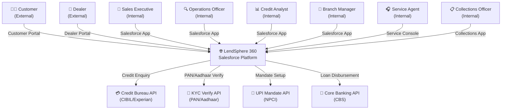
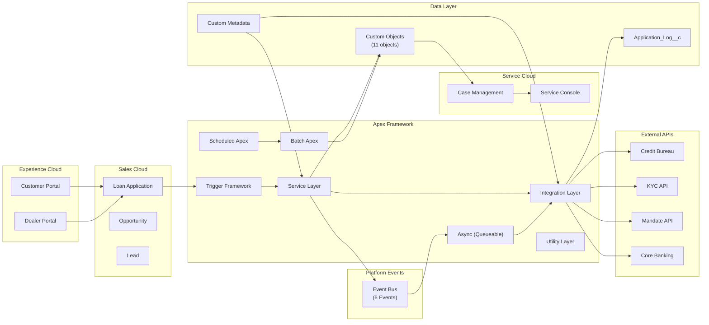
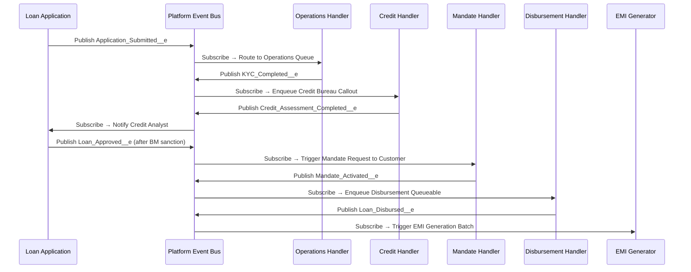
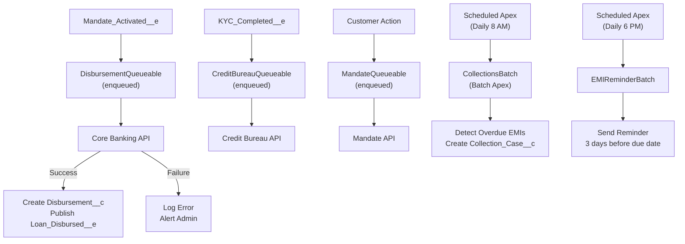
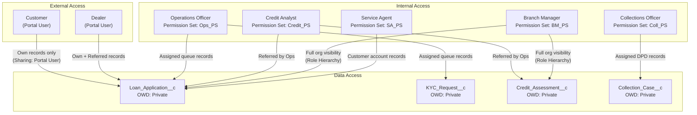
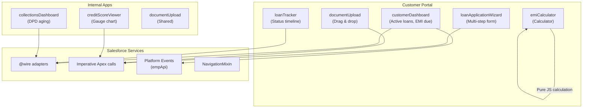

# High Level Design (HLD)

## LendSphere 360 – Digital Lending Platform

| Field | Details |
|---|---|
| **Document Version** | 1.0 |
| **Status** | Approved |
| **Prepared By** | Manasvi Gharat |
| **Date** | May 2026 |

---

## 1. System Context Diagram

---

## 2. End-to-End Loan Lifecycle Flow

```mermaid
flowchart TD
    A["🟢 Lead Captured\n(Sales / Dealer / Customer)"] --> B["Customer Onboarded\n(Account + Contact Created)"]
    B --> C["Loan Application Created\n(Status: Draft)"]
    C --> D["Documents Uploaded\n(Customer / Dealer Portal)"]
    D --> E["Application Submitted\n(Status: Submitted)\n📣 Application_Submitted__e"]
    
    E --> F["Operations Review\n(Document + KYC Verification)"]
    F --> G{"KYC\nPassed?"}
    
    G -->|No| H["🔴 Application Rejected\n(KYC Failed)\nCustomer Notified"]
    G -->|Yes| I["📣 KYC_Completed__e Published\n(Status: KYC Verified)"]
    
    I --> J["🤖 Auto: Credit Bureau API Called\n(Queueable Apex)"]
    J --> K["Credit Score Stored\nRisk Grade Calculated\n📣 Credit_Assessment_Completed__e"]
    
    K --> L["Credit Analyst Reviews\nApprove / Reject"]
    L --> M{"Credit\nApproved?"}
    
    M -->|No| N["🔴 Application Rejected\n(Credit Declined)\nCustomer Notified"]
    M -->|Yes| M2{"Secured\nProduct?"}
    
    M2 -->|No| O["Branch Manager Reviews\nFinal Sanction"]
    M2 -->|Yes| PE1["Property Evaluation Assigned\n(Valuation Officer + Legal Officer)"]
    PE1 --> PE2["Valuation Officer: Site Visit\nMarket Value + FSV Assessed"]
    PE2 --> PE3["Legal Officer: Title Verification\nOwnership + Encumbrance Check"]
    PE3 --> PE4{"Valuation &\nLegal Cleared?"}
    
    PE4 -->|No| PE5["🔴 Application Rejected\n(Property/Legal Issue)\nCustomer Notified"]
    PE4 -->|Yes| O
    
    O --> P{"Sanctioned?"}
    
    P -->|No| Q["🔴 Application Rejected\n(Sanction Declined)\nCustomer Notified"]
    P -->|Yes| R["📣 Loan_Approved__e Published\n(Status: Sanctioned)\nSanction Letter Sent"]
    
    R --> S["Customer Sets Up Mandate\n(UPI / eNACH)"]
    S --> T["🤖 Auto: UPI Mandate API Called\n(Queueable Apex)"]
    T --> U{"Mandate\nActivated?"}
    
    U -->|No| V["🔴 Mandate Failed\nCustomer Retries"]
    V --> S
    U -->|Yes| W["📣 Mandate_Activated__e Published\n(Status: Mandate Active)"]
    
    W --> X["🤖 Auto: Core Banking API Called\n(Queueable Apex - Disbursement)"]
    X --> Y["📣 Loan_Disbursed__e Published\n(Status: Disbursed)\nDisb. Confirmation Sent"]
    
    Y --> Z["EMI Schedule Auto-Generated\n(Batch Apex)"]
    Z --> AA["🟢 Loan Servicing Active\n(EMIs, Cases, Collections)"]
```

---

## 3. Component Interaction Diagram

---

## 4. Module Interaction Matrix

| Module | Depends On | Feeds Into |
|---|---|---|
| Lead Management | - | Customer Onboarding |
| Customer Onboarding | Lead Management | Loan Application |
| Loan Application | Customer Onboarding, Loan Product | KYC, Document Management, Approval |
| KYC Verification | Loan Application | Credit Assessment |
| Document Management | Loan Application | Operations Review |
| Credit Assessment | KYC Verification, Credit Bureau API | Property Evaluation (secured) / Approval Workflow (unsecured) |
| Property Evaluation | Credit Assessment, Loan Product Config | Approval Workflow |
| Approval Workflow | Credit Assessment, Property Evaluation, Document Management | Mandate Setup |
| Mandate Setup | Approval Workflow, UPI API | Disbursement |
| Loan Disbursement | Mandate Setup, Core Banking API | EMI Schedule, Servicing |
| EMI Schedule | Disbursement | Collections, Customer Portal |
| Collections | EMI Schedule | Collection Cases |
| Case Management | Loan Application, EMI Schedule | Service Console |

---

## 5. Platform Event Flow Design

---

## 6. Async Processing Design

---

## 7. Security Model Overview

---

## 8. LWC Component Architecture

