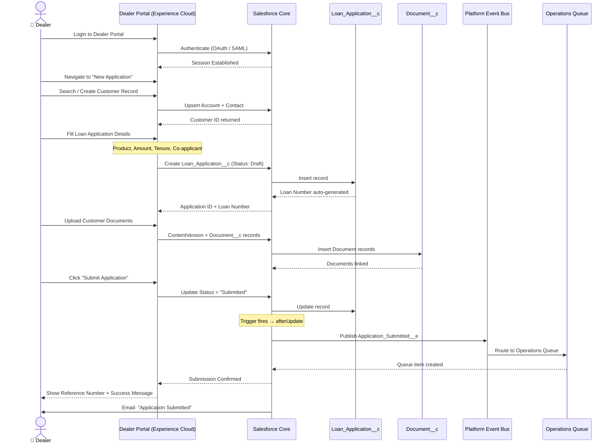
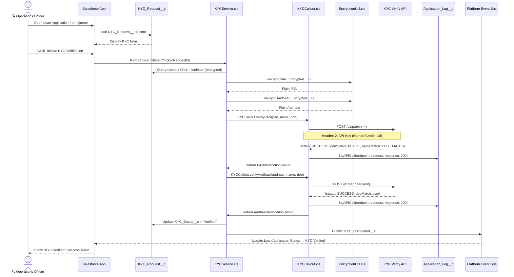
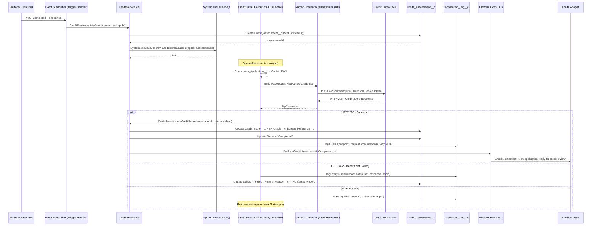
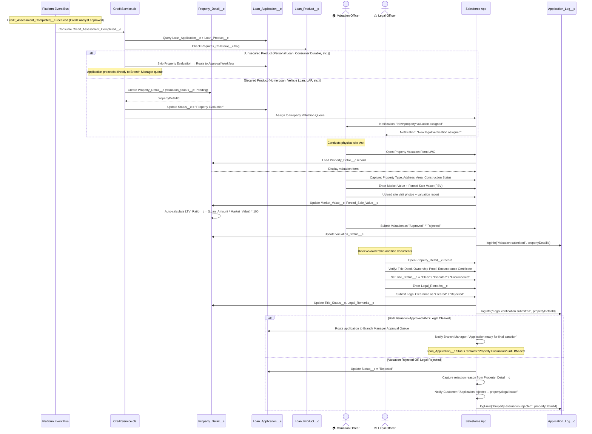
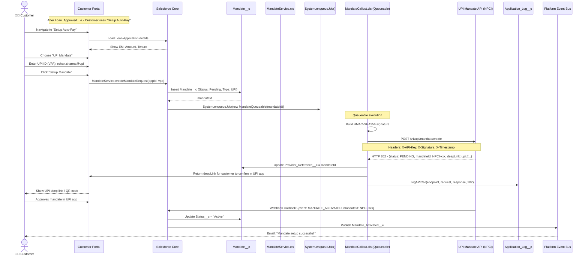
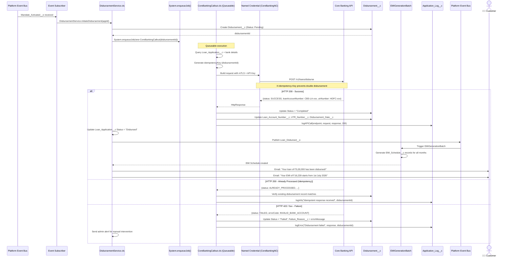
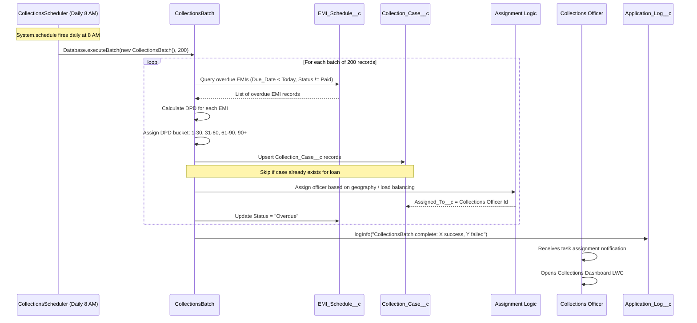

# Sequence Diagrams

## LendSphere 360 – Process Flow Sequence Diagrams

| Field | Details |
|---|---|
| **Document Version** | 1.0 |
| **Status** | Approved |
| **Prepared By** | Manasvi Gharat |
| **Date** | May 2026 |

---

## Sequence 1: Dealer Loan Application Submission

---

## Sequence 2: KYC Verification Flow

---

## Sequence 3: Credit Bureau API Integration

---

## Sequence 4: Property & Collateral Evaluation

---

## Sequence 5: UPI Mandate Setup

---

## Sequence 6: Loan Disbursement

---

## Sequence 7: Collections Follow-Up (Batch Processing)

